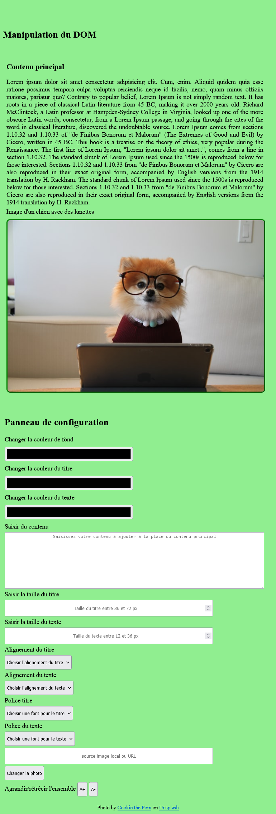

# TP : manipulation du DOM partie HTML/CSS

## Objectifs du TP

1. Travailler à plusieurs sur le même dépôt git
2. Créez des pages web en utilisant les langages HTML/CSS

## contexte globale de l'application à produire

Vous devez créer une application Web avec les langages HTML, CSS.
La page web est en deux parties : 
- La partie de gauche contient des éléments HTML (image, paragraphe, textarea etc.)
- La partie de droite contient un panneau de configuration permettant de modifier les éléments de la partie de gauche à l'aide du langage Javascript que nous verrons prochainement.
Dans cette partie du TP, vous allez utiliser uniquement les langages HTML et CSS.
Voici le planning des tâches à accomplir :
1. Jour 1 :
    - Création de la page web avec les 2 blocs (droite et gauche) en utilisant le langage HTML
    - Mise en page CSS avec les positions
2. Jour 2 :
    - Responsive design pour une version mobile avec les media queries
3. Jour 3 :
    - Mise en page avec le FlexBox
    - Mise en page avec le CSS Grid
    - Si le temps le permet, intégration de Bootstrap

### Exigences Git

- Créer des branches spécifiques pour la réalisation d'une tâche
- Commitez tous vos changements

## Définitions

- DOM : Document Object Model, nous verrons cela en détail dans le cours de Javascript. Pour faire simple, c'est la manipulation (ajout,modification, suppression) des éléments HTML et CSS à l'aide du langage Javascript.
- ***Owner*** : propriétaire du dépôt.
- ***Developers*** : collaborateurs qui travaillent sur le dépôt.
- ***Maintenairs*** : collaborateurs qui ont un peu plus de droits que les *developers*.

## Ressources

- [Lien vers l'annexe](../1-exercices/annexe.md)

## Logiciels

Utilisez Visual Studio Code et les extensions suivantes :
- Live Server
- Emmet
- Beautify ou Prettier

### Formation des groupes

- En binôme :
 - 1 *owner*
 - 1 *developers*

### Responsabilités du owner

1. Créez un dépôt git tp-html-css-js.
2. Il invite un collaborateur à participer à ce projet.
3. Le collaborateur accepte l'invitation.

Se reporter aux explications du [TP sur Git et GitHub](https://github.com/2022-06-13-POEI-JAVA-SALESFORCE/git/tree/main/interns/3-tp) pour avoir les indications sur l'invitation des membres participant au projet.

## Consigne Jour 1 : création d'une page web avec le langage HTML et mise en page avec les positions

1. Créez une page html avec 2 blocs
1.1 Le bloc de gauche contenant : 
- un titre de niveau 1 ;
- du texte (copier/coller du [Lorem ipsum](https://www.lipsum.com/)) ;
- une image (utilisez le site [unsplash](https://unsplash.com/)).

1.2 Un bloc à droite contenant :
- un label "couleur de fond" avec un champ de type *color* ;
- un label "couleur du titre" avec un champ de type *color* ;
- un label "couleur de texte" avec un champ de type *color* ;
- un label "contenu" avec un champ de textarea ;
- un label "taille du titre" avec un champ de type number, taille comprise entre 36px et 72px ;
- un label "taille du texte" avec un champ de type number, taille comprise entre 12px et 36px ;
- un label "alignement du titre" avec un select ayant les options droite, gauche, centré et justifié ;
- un label "alignement du texte" avec un select ayant les options droite, gauche, centré et justifié ;
- un label "police du texte" avec une sélection  de fonts (polices).

### Maquette de la page version desktop (bureau)

## Consigne jour 2 : responsive design media queries

- Sur une branche dédiée, effectuez la mise en page mobile à l'aide des media queries.
- Sur une autre branche, effectuez la mise en page pour une tablette.

### Maquette de la page version mobile

### Maquette de la page version tablette

## Consigne jour 3 : mise en page FlexBox et Grid

- Dans une branche dédiée, faire la mise en page en utilisant les propriétés Flexbox.
- Dans une autre branche dédiée, faire la mise en page en utilisant les propriétés CSS Grid.

### Bonus

- Effectuez la mise en page de toutes les versions avec Bootstrap.